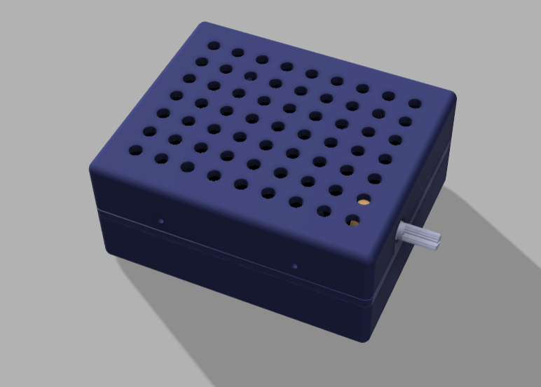
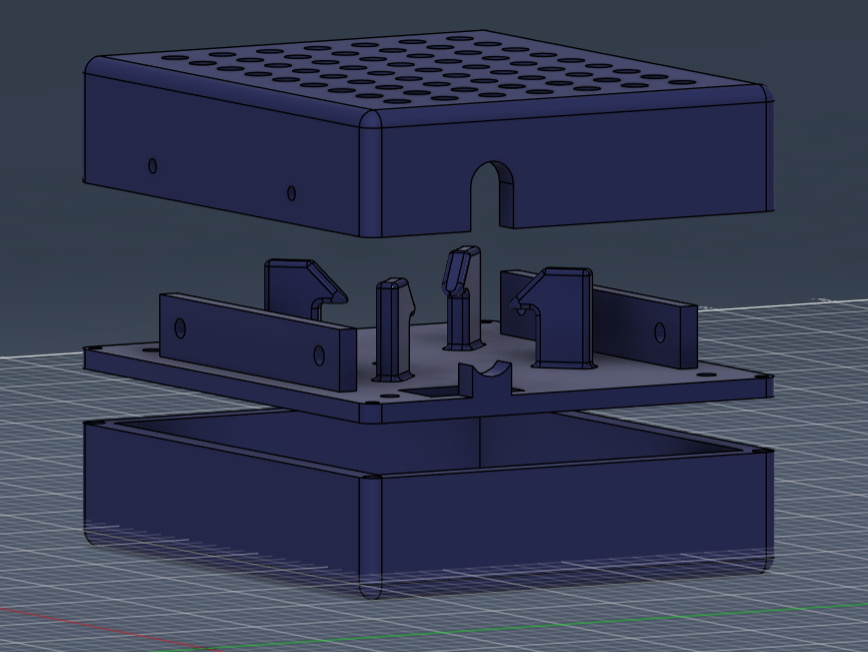
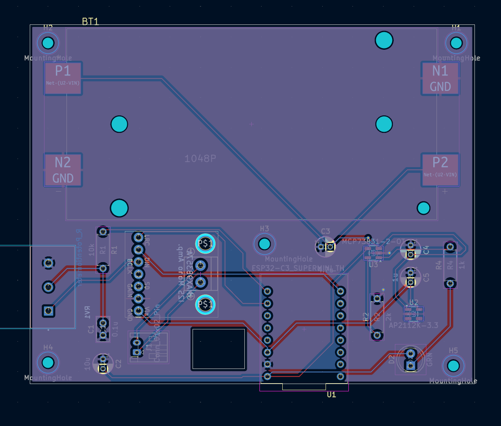
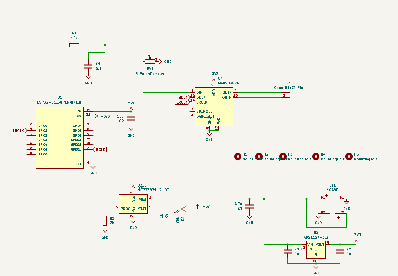

# White Noise Machine 


A very simple white noise generator using an ESP32 (C3-SuperMini) and an audio amplifier. I made this to help me sleep.
Its kinda hard for me to sleep, especially with noises, even if it is small. White/pink noise is more comfortable for me. Also this will help blockout small noises

---

## Enclosure



---

## PCB



---

## Schematic



---

## BOM
| Qty | Component | Notes |
|----:|-----------|-------|
| 1 | ESP32 Super Mini | Microcontroller |
| 1 | 8 Ω 1 W Speaker (35 mm diameter) | Speaker |
| 1 | MAX98357A Audio Amplifier Breakout Board | I2S Class-D amplifier |
| 1 | MCP73831 | Li-ion/Li-Po charging IC |
| 1 | AP1221K 3.3 V | 3.3 V LDO voltage regulator |
| 1 | 100 kΩ Horizontal Potentiometer | Volume control |
| 1 | 10 µF Capacitor | |
| 2 | 1 µF Capacitor | |
| 1 | 4.7 µF Capacitor | |
| 1 | 1 kΩ Resistor | |
| 1 | 2 kΩ Resistor | |
| 1 | 10 kΩ Resistor | |
| 1 | 18650 Dual SMD Battery Holder | |
| 4 | M2 × 3 mm Heat-Set Insert | |
| 4 | M2 × 6 mm Heat-Set Insert | |
| 4 | M2 × 8 mm Screw | |
| 4 | M2 × 10 mm Screw | |

---

## How to assemble

1. Insert the 3mm insert on the walls projected from the middle part, and 6mm on the bottom part
2. screw pcb on to the bottom of the middle part
3. screw the middle to the bottom
4. screw the top to the middle with screws on the walls

## How to Flash

### Prerequisites
- Python 3
- esptool

### Flash Firmware

1. Clone the repository.
2. Open the `firmware` folder in terminal.
3. Connect the ESP32-C3 to your computer and run:

```bash
esptool.py --chip esp32c3 --baud 460800 write_flash \
  0x0000 bootloader.bin \
  0x8000 partitions.bin \
  0xE000 boot_app0.bin \
  0x10000 firmware.bin
```

---
